# Project Diagrams - ESD Employee Management System

---

## Class Diagrams

### Entity Relationship Diagram

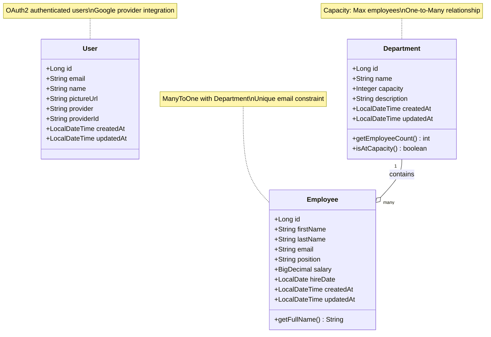

### Service Layer Architecture

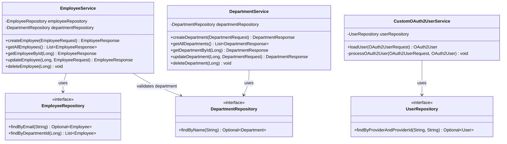

### Controller Layer

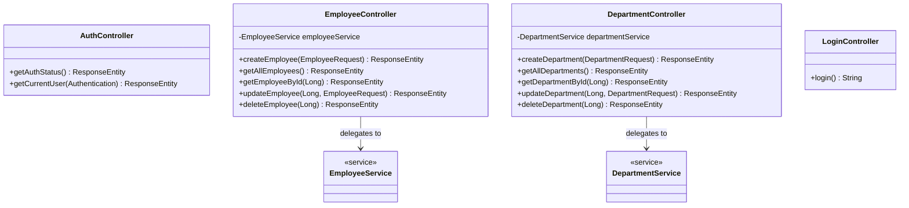

### Exception Handling Architecture

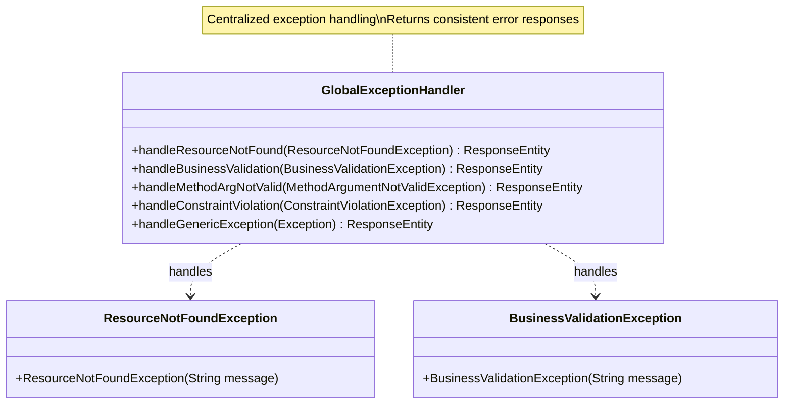

---

## Flow Diagrams

### 1. OAuth2 Google Login Flow

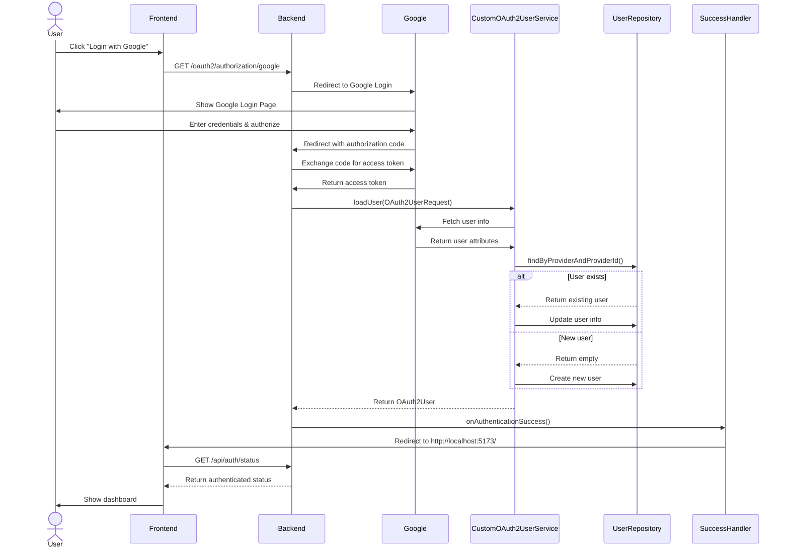

### 2. Logout Flow

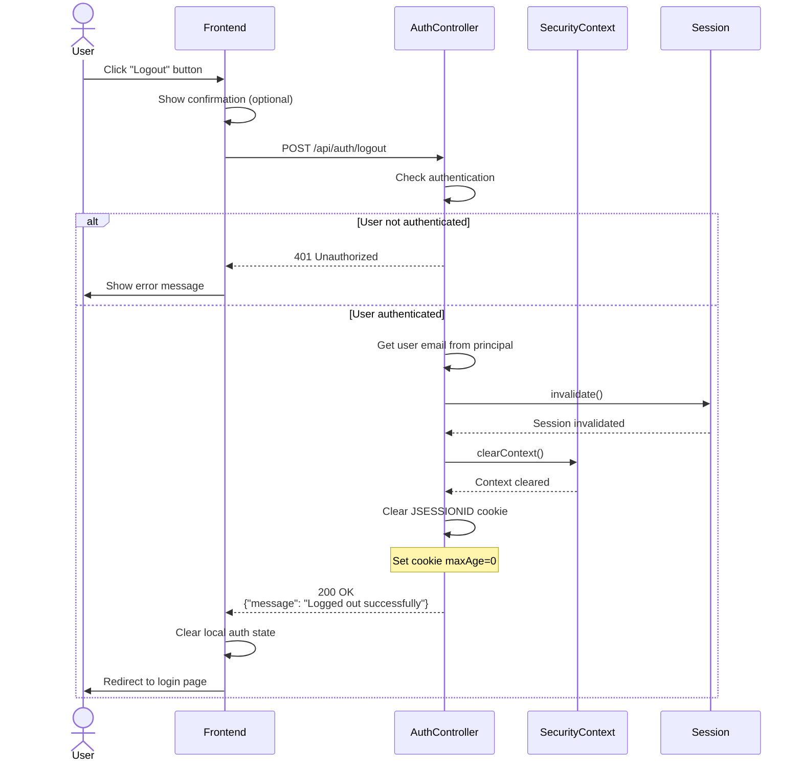

### 3. Create Employee Flow

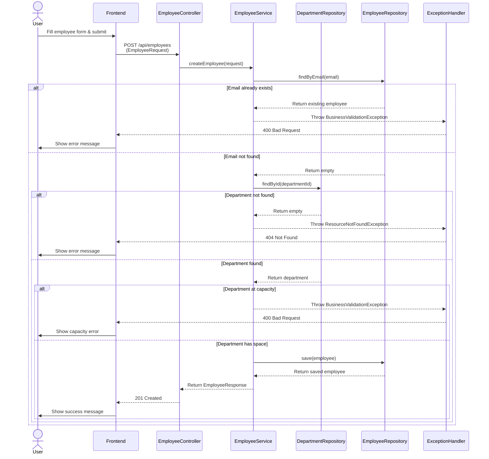

### 4. Get All Employees Flow

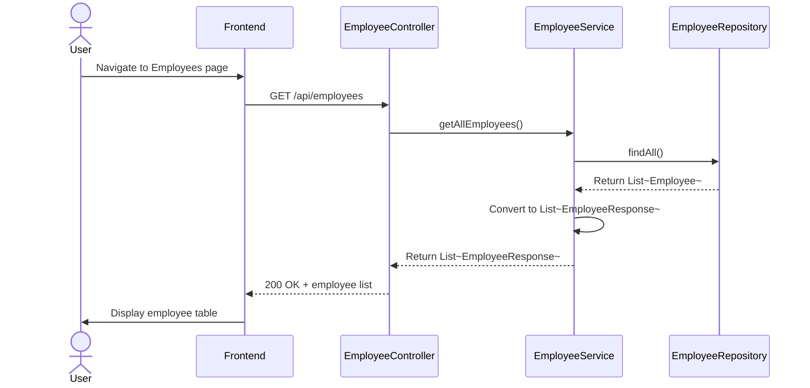

### 5. Update Employee Flow

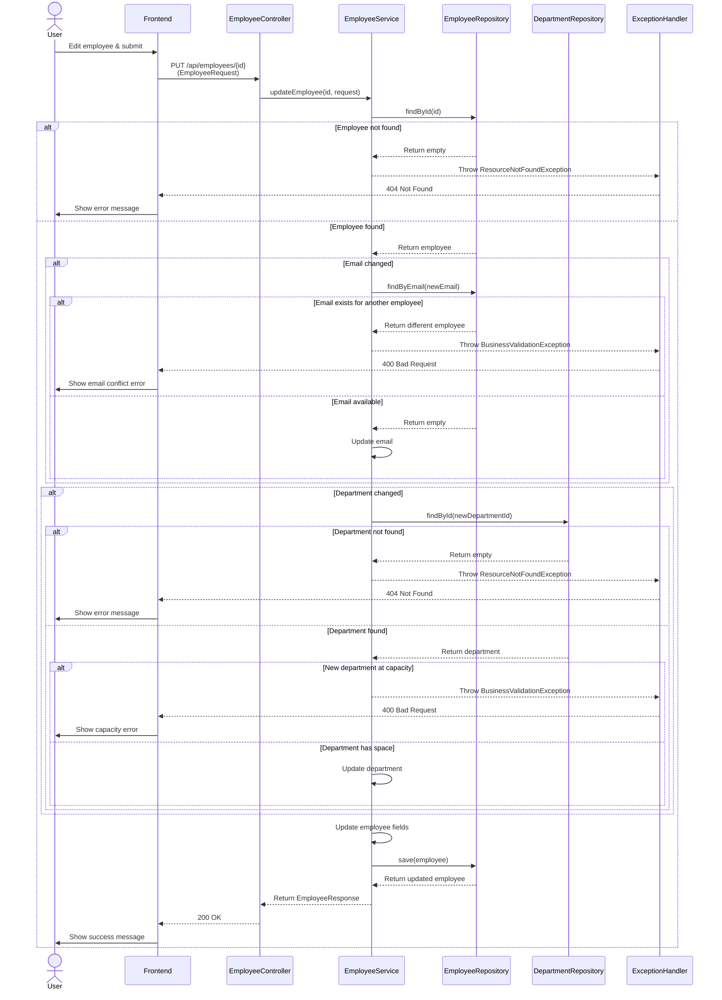

### 6. Delete Employee Flow

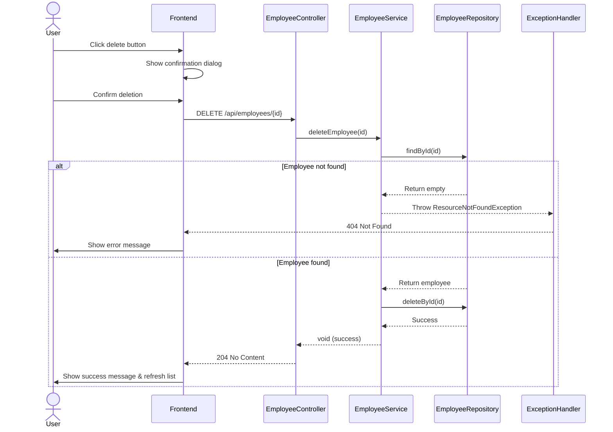

### 7. Create Department Flow

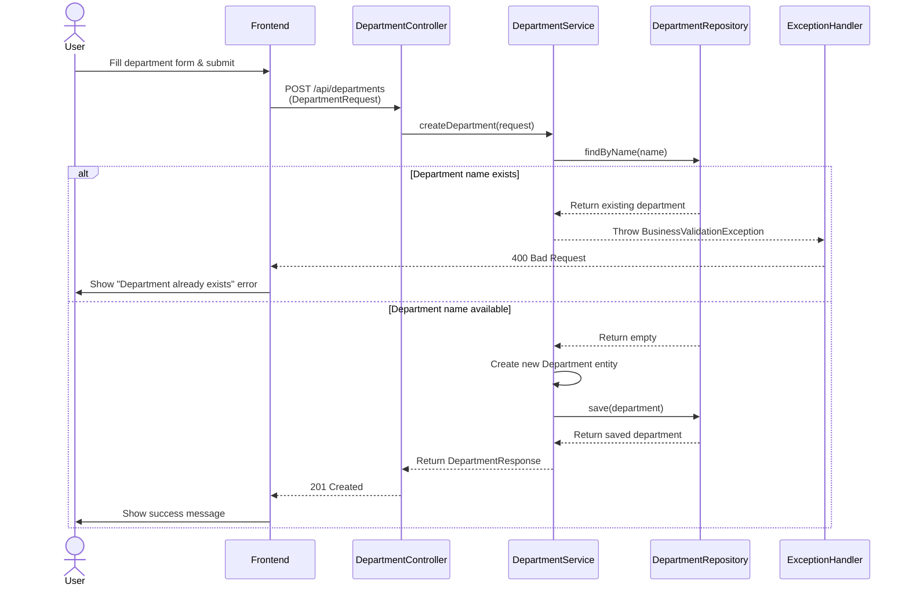

### 8. Update Department Flow

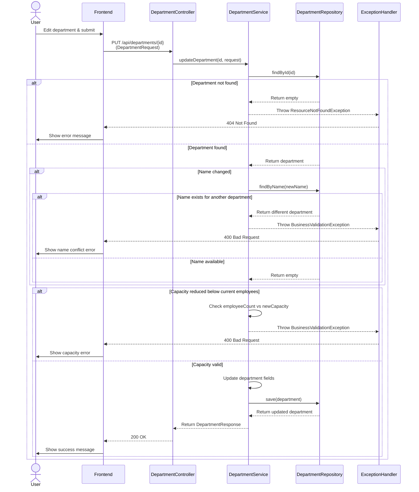

### 9. Delete Department Flow

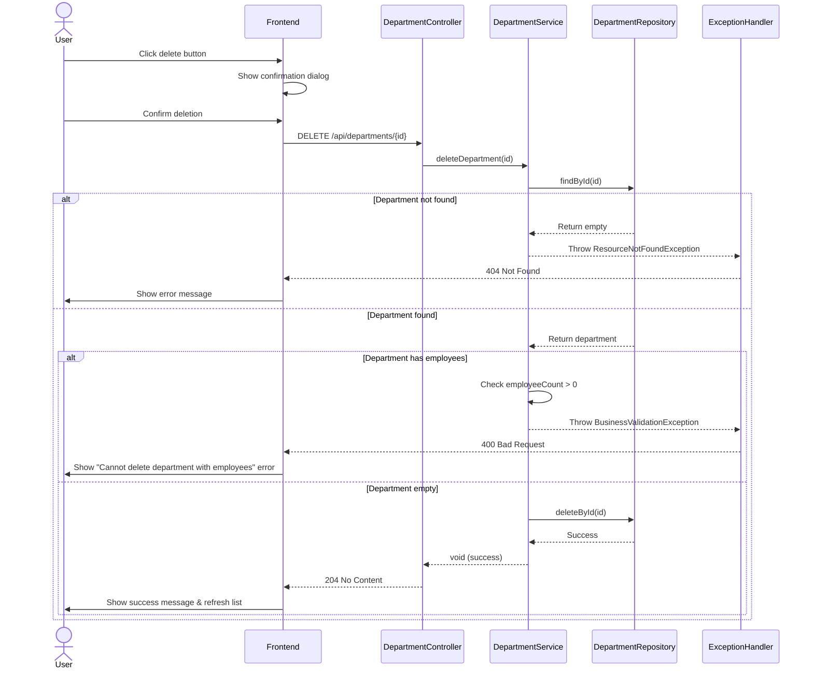

### 10. Exception Handling Flow

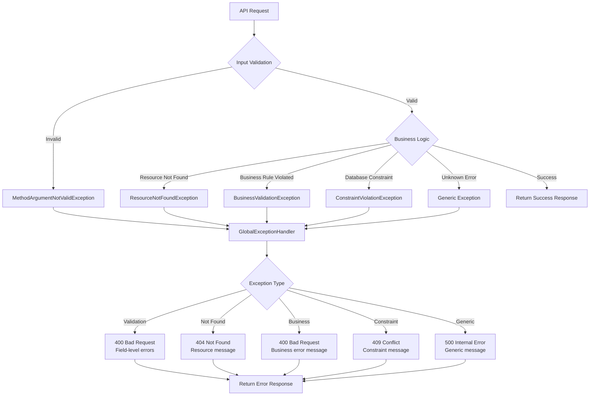

### 11. Complete Request Lifecycle

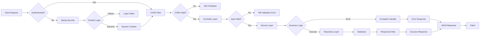

---

## Architecture Overview

### Layered Architecture Diagram

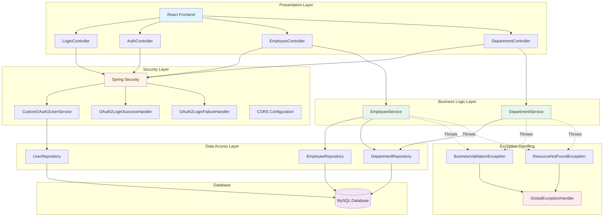

---